# MARAgent

Official implementation placeholder for **A Vision-Language Multi-Agent Framework for Safety-Aware CT Metal Artifact Reduction**.

MARAgent is a vision-language model driven multi-agent framework for adaptive and safety-aware CT metal artifact reduction (MAR). Instead of applying one fixed MAR model to all inputs, MARAgent first perceives anatomical context and artifact severity, then dynamically chooses one of three restoration routes: Fast Restoration, Memory Search, or All Model Race. A Report Agent further analyzes difference maps to warn about possible structural loss.

> Note: In this GitHub upload, `tools/` keeps the model-name directory structure only. To run training or full model inference, restore the corresponding MAR model source code and checkpoints under `tools/` or edit `configs/default.yaml` to point to local implementations and weights.

## 1. Method Workflow

The paper workflow is shown below.

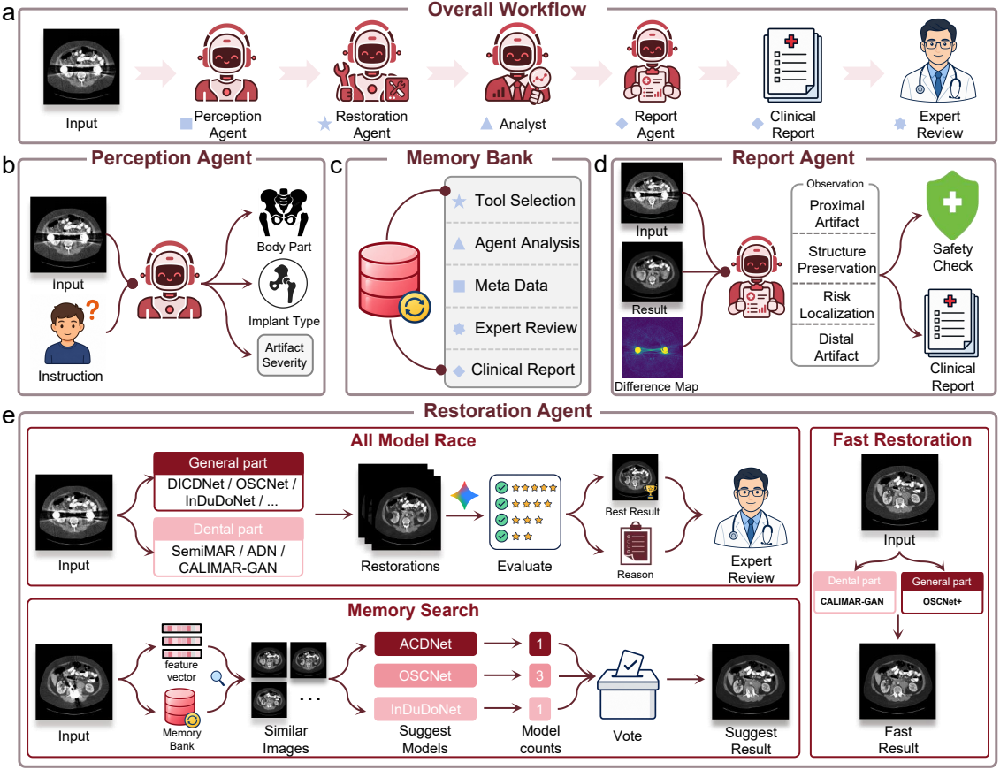


Core modules:

- **Perception Agent**: estimates anatomical region, implant type, and artifact severity.
- **Smart Route**: selects Fast Restoration, Memory Search, or All Model Race.
- **Restoration Agent**: runs candidate MAR experts and selects the best output without paired reference images.
- **Memory Bank**: stores expert-validated cases for retrieval-augmented routing.
- **Report Agent**: compares input, result, and difference map to identify possible tissue loss or over-smoothing.

An example of the multi-agent communication loop is shown here.

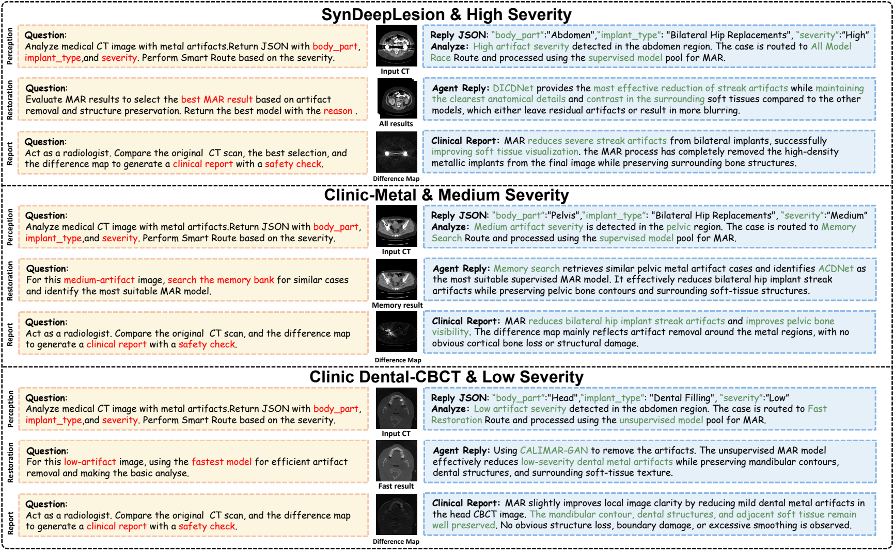

## 2. Code Tree

```text
MARAgent/
|-- configs/
|   `-- default.yaml
|-- maragent/
|   |-- agents/
|   |   |-- perception.py
|   |   |-- restoration.py
|   |   `-- report.py
|   |-- core/
|   |   |-- preprocessing.py
|   |   |-- router.py
|   |   `-- diff.py
|   |-- memory/
|   |   `-- bank.py
|   |-- models/
|   |   `-- registry.py
|   |-- vlm/
|   |   `-- client.py
|   |-- cli.py
|   |-- config.py
|   |-- pipeline.py
|   `-- schemas.py
|-- memory_bank/
|   |-- dental/
|   `-- general/
|-- result/
|   |-- Inputs/
|   |-- Best_Selections/
|   |-- Difference_Maps/
|   |-- Case_Summaries/
|   `-- <model-name>/
|-- scripts/
|   |-- run_maragent.py
|   `-- sync_weights.ps1
|-- tools/
|   |-- ACDNet/
|   |-- ADN/
|   `-- .../
`-- weights/
    `-- README.md
```

## 3. Datasets

### SynDeepLesion

- Source: [SynDeepLesion](https://github.com/hongwang01/SynDeepLesion)
- Usage in this paper: 1,200 high-quality CT slices without obvious artifacts were selected and combined with 100 metal masks for physics-based artifact simulation.
- Split principle:
  - Training: 1,000 CT slices and 90 metal masks.
  - Testing: 200 CT slices and 10 unseen metal masks.

### CTPelvic1K

- Source: [CTPelvic1K](https://github.com/MIRACLE-Center/CTPelvic1K)
- Usage in this paper:
  - `CLINIC`: 103 preoperative metal-free pelvic CT scans, used to train the downstream multi-bone segmentation model.
  - `CLINIC-metal`: 75 postoperative pelvic CT cases with metallic implants, used as the clinical generalization benchmark.
- Split principle:
  - Metal-free `CLINIC` scans are used for downstream segmentation training.
  - `CLINIC-metal` scans are used for testing MAR generalization under real postoperative artifacts.

### Clinical Dental-CBCT Dataset

- Source: [Clinical Dental-CBCT](https://tianchi.aliyun.com/competition/entrance/532440/information)
- Usage in this paper:
  - 500 clinical cases in total.
  - 300 cases without obvious metal artifacts.
  - 200 cases with metal artifacts.
  - Used for training and evaluating unsupervised MAR models under unpaired real dental CBCT conditions.
- Split principle:
  - Patient-level split.
  - Training:test ratio is `9:1`.

## 4. Environment

Paper environment:

```text
OS: Ubuntu 20.04
GPU: single NVIDIA V100
Python: 3.8
PyTorch: 2.0.0
VLM backbone: gemini-3.1-pro-preview
Core controller temperature: 0
Memory retrieval: top-5 similar historical cases
```

Install dependencies:

```bash
pip install -r requirements.txt
```

## 5. Inference Steps

### Single file

```bash
python scripts/run_maragent.py \
  --input /path/to/case.png \
  --config configs/default.yaml \
  --output result
```

The same entrypoint accepts `.npy`, `.h5`, and `.hdf5` files:


### Batch PNG inference

```bash
python scripts/run_maragent.py \
  --input-dir /path/to/png_cases \
  --glob "*.png" \
  --config configs/default.yaml \
  --output result
```

### Batch NPY inference

```bash
python scripts/run_maragent.py \
  --input-dir /path/to/npy_cases \
  --glob "*.npy" \
  --config configs/default.yaml \
  --output result
```

### Batch H5 inference

```bash
python scripts/run_maragent.py \
  --input-dir /path/to/SynDeepLesion/test/test_640geo \
  --glob "**/*.h5" \
  --config configs/default.yaml \
  --output result
```


## 6. Experimental Results

### Table I. SynDeepLesion PSNR and SSIM
PSNR/SSIM of Different MAR Methods on Synthesized DeepLesion. The best results and the runner-ups are highlighted in bold and underlined, respectively. The numbers after the arrows indicate the absolute improvement or decline compared with the DICDNet.
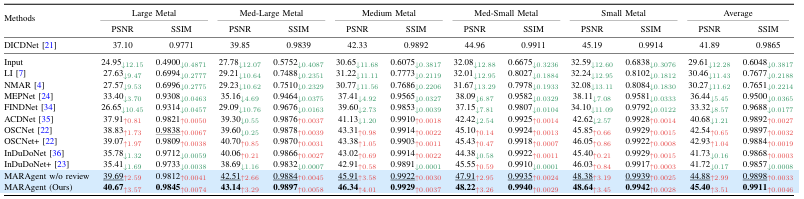

### Table II. SynDeepLesion RMSE and MAE
RMSE/MAE of Different MAR Methods on Synthesized DeepLesion. The best results and the runner-ups are highlighted in bold and underlined, respectively. All metrics are multiplied by $100$ for better readability. The numbers after the arrows indicate the absolute improvement or decline compared with the DICDNet.
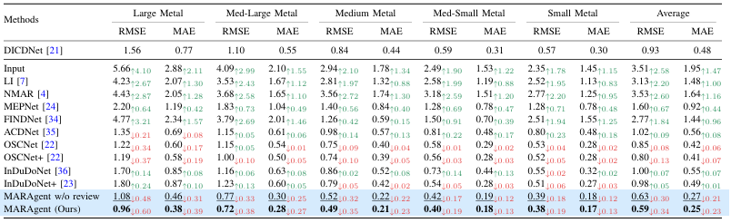

Quantitative distributions on the SynDeepLesion dataset. Higher PSNR/SSIM and lower RMSE/MAE indicate better performance. RMSE and MAE values are scaled by a factor of 10 for visualization. *** denotes statistical signifi cance compared with MARAgent (p < 0.001).

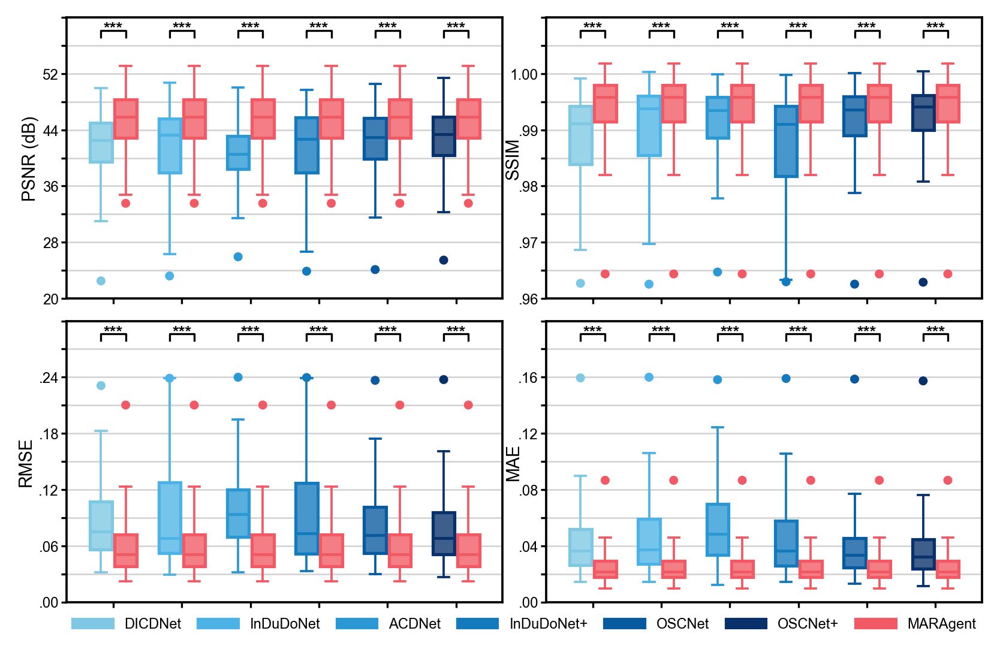

Qualitative comparison on the SynDeepLesion dataset (window 450/50 HU). MARAgent effectively suppresses
streak artifacts while producing smaller difference-map responses, indicating better preservation of anatomical structures.

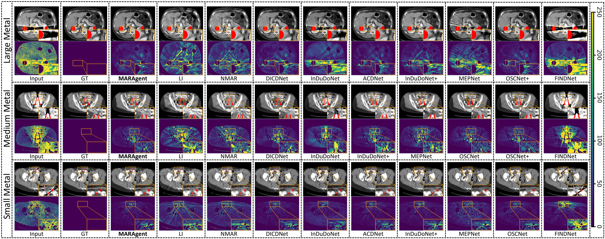

### Table III. Downstream pelvic segmentation on CTPelvic1K

Performance comparison of different MAR methods on the downstream lesion segmentation task. Evaluation metrics include Dice, ASSD, HD95 (pixels), and PPV. The best results are bolded and the runner-up results are underlined.

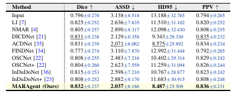

Downstream segmentation visualization on the CTPelvic1K clinical dataset (window 450/50 HU). MARAgent better preserves pelvic structures and produces more accurate segmentation masks under real metal artifacts.

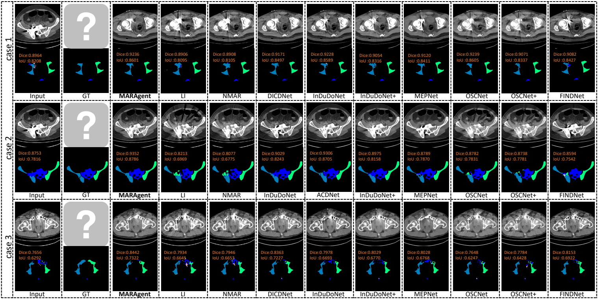

### Table IV. Clinical Dental-CBCT Likert-scale evaluation
Likert-scale evaluation scores of different models by two doctors. Values are reported as mean ± standard deviation (SD) with 95% confidence intervals (CI).
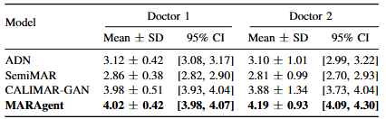

Radiologist subjective evaluation using a five-point Likert scale. MARAgent achieves the highest average scores from both radiologists, indicating better artifact removal and structure preservation.

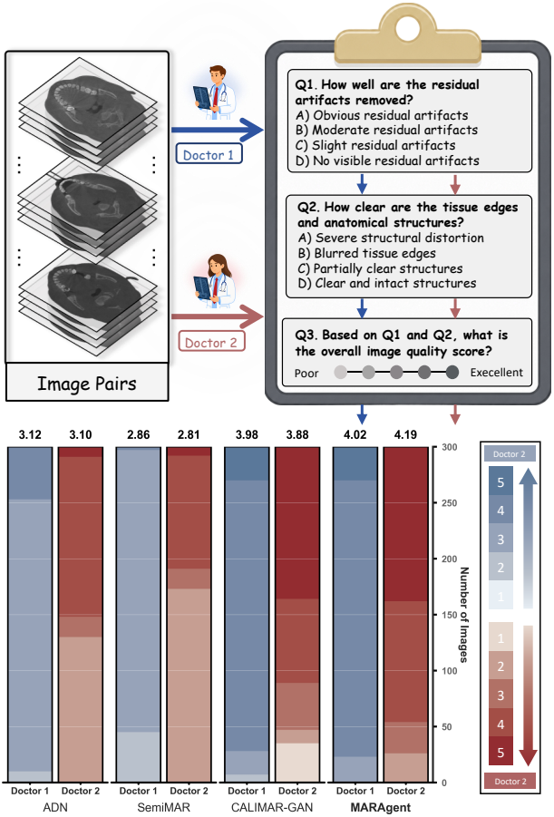

Qualitative comparison on the Clinical Dental-CBCT dataset (window 3000/400 HU).} MARAgent suppresses dental metal artifacts while preserving alveolar bone boundaries, periodontal structures, and anatomical details.

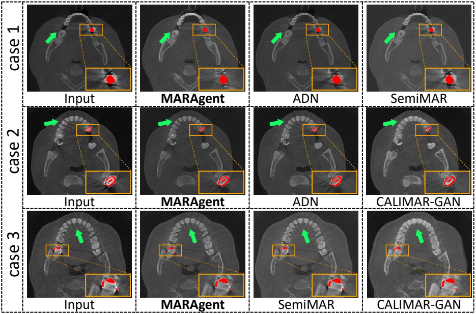
